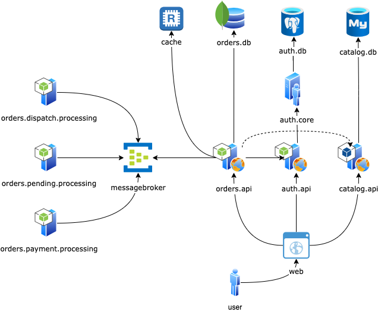

# Shop.App
Prototype of the shop app implementation as a playground for integration of different distributed components

# Docker compose commands
* `docker-compose down -v {service name}` - takes down service volume, e.g. if need to re-run init scripts for database
* `docker-compose up --build -d {service name}` - start/restart single container
* `docker-compose build --no-cache` - rebuilds all containers w/u using cache
* `docker-compose up --build` - starts all containers and rebuilds them

# Architecture Overview
