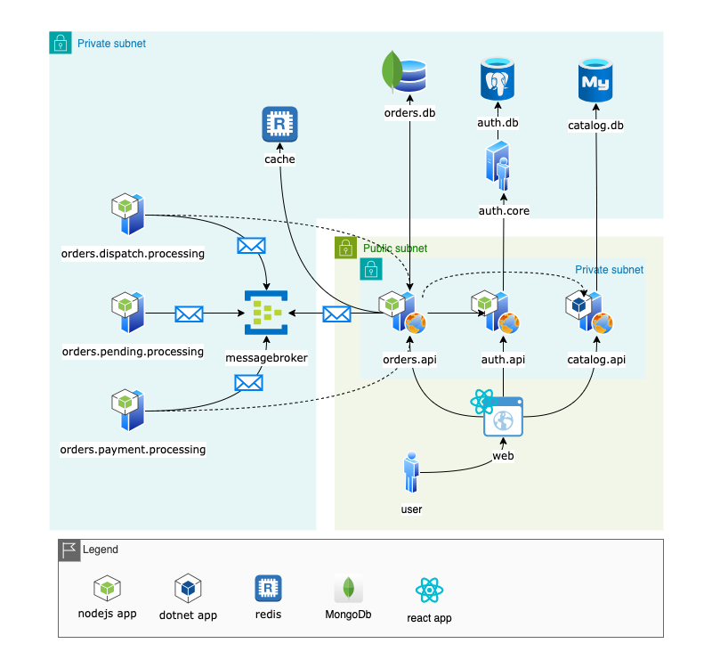

# Build Status

 

# Shop.App
Prototype of the shop app implementation used as a playground for integrating various distributed components.

## Project Structure
The project is structured as a monorepo using npm workspaces. This structure primarily applies to node.js-based projects, although other projects (e.g., .NET projects) would follow a similar arrangement.

- Standalone applications reside in the `/apps` folder and do not rely on each other from a package reference standpoint.
- Reusable packages across different apps are located in `/packages`. In node.js projects, they're referenced using workspace local references.
  - Each package in the `/packages` folder needs to be built before consuming the project as it relies on the existence of `@package-name/dist`.
  - In a Docker environment, this is resolved by creating the base image `shop.app.packages`, already containing pre-built packages placed into the `/app/packages` folder within the docker image (refer to example `apps/shop.app.orders.api/Dockerfile`).

## Running apps
- Each app can be launched from its respective `/apps` folder using `npm run start`.
  - Apps may require specific environment variables for external dependencies. If running them in a container, ensure they expose ports, as some services reside in a private network and don't expose ports to the host.
- Additionally, apps can be started from the root folder (e.g., `npm run start-web` starts `shop.app.web`).
  - When running an app from the CLI, ensure to stop the corresponding container to avoid port conflicts.

## Running with Docker
- The `.env` file contains most environment variables used by different docker services.
- Running `docker-compose up --build -d` starts all containers, rebuilding them upfront.
- Once started, the web app will be accessible at `http://localhost:3000/`.
  - To allow access from other computers on the local network, change all instances of `localhost` in the `.env` file to your local IP address (e.g., `192.168.0.1`) for proper CORS configuration for APIs.
- To test with ports not exposed for apps from app-private-network network run: `docker-compose -f docker-compose.yml -f docker-compose.no-ports.yml up --build -d`

### Docker Compose Commands Quick Reference
- `docker-compose down -v {service name}`: Takes down service volume, useful for re-running init scripts for the database.
- `docker-compose up --build -d {service name}`: Starts/restarts a single container.
- `docker-compose build --no-cache`: Rebuilds all containers without using cache.
  - Add `--progress plain` to view more command outputs.
- `docker-compose up --build`: Starts and rebuilds all containers.
  - Add `--remove-orphans` to remove orphan containers 

## Adding re-usable packages
To share common logic across different apps add new package under `/packages` folder. This will be automatically recognized by npm workspace and will allow adding local references from `package` to `app`. Note, that package project should be built prior to dependant app. See more about [npm workspace](https://ruanmartinelli.com/posts/npm-7-workspaces-1/)
* How to add reference `package a` in `app a`:
  `root> npm install ./packages/<package a> --workspace ./apps/<app a>`
* Update docker image for packages here - `packages/Dockerfile` and add build step for package
* Update github workflow config - `.github/workflows/nodejs.yml` and add build step for new package

## Architecture Overview

## Application Details
- [shop.app.web](https://github.com/limanartem/Shop.App/tree/master/apps/shop.app.web): Main front-end application built using React, Redux, CRA, etc.
- [shop.app.auth.api](https://github.com/limanartem/Shop.App/tree/master/apps/shop.app.auth.api): Authentication provider API built on top of the open-source authentication framework [Supertokens.io](https://supertokens.io).
- [shop.app.catalog.api](https://github.com/limanartem/Shop.App/tree/master/apps/shop.app.catalog.api): REST API services providing access to the shop catalog (product categories, products, etc.), built using [.NET minimal API](https://learn.microsoft.com/en-us/aspnet/core/fundamentals/minimal-apis?view=aspnetcore-8.0). This API does not require authentication.
- [shop.app.orders.api](https://github.com/limanartem/Shop.App/tree/master/apps/shop.app.orders.api): REST API & GraphQL services for order submission and retrieval. Built based on node.js using [Express](https://expressjs.com) app.

  Endpoints consumed by `shop.app.web` frontend necessitate user authentication via bearer tokens issued by `shop.app.auth.api` during the login process.

  Some endpoints are exclusively available for backend-to-backend communication, such as changing order status from order processing workloads. A special technical API user is configured with the required `role` to access these APIs.

- [shop.app.orders.processing](https://github.com/limanartem/Shop.App/tree/master/apps/shop.app.orders.processing): Node.js-based app simulating the order processing flow by updating its status over time (new order processing, payment processing, dispatching).

  At each step, the order is placed in a message queue and picked by the order processing instance. Consequently, the order status changes over time and can be refreshed on the UI.

## Additional Services (from docker-compose)
- `shop.app.catalog.db`: Database used by `shop.app.catalog.api` app, storing all shop products. It utilizes the latest version of [MySQL](https://www.mysql.com) and includes an initialization script that automatically populates the catalog upon the first container startup.
- `shop.app.auth.db`: Database used by `shop.app.auth.core` app to store user details, based on the latest image of [PostgreSQL](https://www.postgresql.org).
- `shop.app.auth.core`: Authentication core using the Supertokens image for PostgreSQL.
- `shop.app.cache`: Key-Value caching service based on [Redis.io](https://redis.io).
- `shop.app.messagebroker`: Message broker service providing [AMQP](https://www.amqp.org) messaging protocol powered by [RabbitMQ](https://www.rabbitmq.com), orchestrating order processing across different workloads.
- `shop.app.orders.db`: NoSQL database managing orders placed by users via the `shop.app.orders.api` REST API. Utilizes [MongoDB](https://www.mongodb.com).

## Troubleshooting
* When running docker compose build on Windows machine some .sh file may fail to execute due to different line end feeding characters on Linux and Windows based systems. To quickly fix issue, in VS Code switch to CRLF EOL sequence see  https://essenceofcode.com/2019/11/20/linux-style-line-feeds-in-docker-desktop-on-windows/ for some additional information
